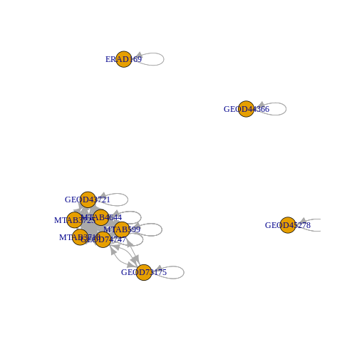

```{r setup, include=FALSE}
knitr::opts_chunk$set(echo = TRUE, message=FALSE, warning=FALSE, fig.height=2, fig.align="left")
```

I present here two different methods to be used in the context of the integration of datasets from different sources, subject to batch effect. I extracted one of them from an existing paper and I introduce a new one in this paper. Although both of them are based on Principal Components Analysis, the first one has what I would call a "sample-based" approach while the second one focuses more on the information given about genes.

The final aim of this work is the creation of several Expression Atlases by merging the RNASeq datasets available on the existing Expression Atlas. The building of such atlases shall be done using heterogenous datasets which can definitely not be supposed to follow the same distribution. Therefore many batch effect correction algorithms can already be considered as irrelevant for this problem (batch-mean centering to name but one, as well as every method which doesn't take biological factors into account).

# The data : Mouse Expression Atlas
In this section, I show a typical workflow of data preparation before integration.
```{r library,include=FALSE}
#library(eigenangles)
library(magrittr)
library(purrr)
library(stringr)
library(SummarizedExperiment)
library(ggplot2)
library(gridExtra)
```
```{r dataset preparation}
#relative path to the data of all the experiments
batch_data<-"Mouse Expression Atlas/batch data/"
#list of experiments
experiments<-list()
for(filename in dir(batch_data)){
  experiments[[filename %>% str_split("-") %>% unlist %>% extract(2:3) %>% paste(collapse="")]] <- get(load(paste0(batch_data,filename)))$rnaseq
}
```
```{r intersections, fig.cap="\\label{figs:figs} Graph of intersections between the experiments", fig.show="hide"}
#tissues investigated in each experiment
tissues<-experiments %>% map(~.$organism_part)
#matrix of intersections between batches
intersections<-NULL
for(i in tissues %>% seq_along){
  for(j in tissues %>% seq_along){
    intersections%<>%c(length(intersect(tissues[[i]],tissues[[j]])))
  }
}
intersections %<>% matrix(length(tissues)) %<>% set_colnames(names(tissues)) %<>% set_rownames(names(tissues))
library(igraph)
intersections %>% graph_from_adjacency_matrix %>% plot
```


As three experiments are isolated, one shall not try to integrate them, as it is not possible to correct batch effect with these experiments (since it is not possible then to dissociate batch effect from biological variations).
```{r exclusion of isolated datasets}
experiments[c('GEOD45278','GEOD44366','ERAD169')]<-NULL
```
After these steps, the package `eigenangles` can be used to integrate the datasets. The datasets are merged within a unique `SummarizedExperiment` object. If one sets `method="none"`, no batch effect correction is applied. However the count matrix is log-transformed by default (it is possible not to do this transformation by setting `log=FALSE` within the call to `integrate.experiments`).
```{r integrate none}
library(eigenangles)
integrate.experiments(list=experiments, method="none") -> all
all
```

One can apply the available batch effect correction methods to integrate these experiments, such as :

- ComBat :
```{r integrate combat}
integrate.experiments(list=experiments, method="combat", model = ~organism_part) -> combat
```
- RUVs :
```{r integrate ruv}
integrate.experiments(list=experiments, method="ruv", model = ~organism_part) -> ruv
```
- MNN :
```{r integrate mnn}
integrate.experiments(list=experiments, method="mnn", model = ~organism_part) -> mnn
```

Please note the presence of a `model` argument, that gives the biological differences between the samples, to be taken into account during batch effect correction. Here it is a formula `~organism_part` referring to the so called column in the `colData()` fields of all the experiments.

# A sample-based criterion
I introduce here the guided PCA which comes originally from an article by Sarah Reese [A new statistic for identifying batch effects in high-throughput genomic data that uses guided principal component analysis]. The `eigenangles` package has an implementation of this concept in order to compare the different batch effect correction algorithms.

The idea of guided PCA is to perform PCA on a batch-aggregated dataset. All the samples from the same batch are averaged or summed to form one sample and PCA is performed on these new samples (one sample per batch). This PCA yields to some geometrical axes, that we will called guided principal components, different from the ones that standard PCA would give. The original samples (not aggregated) are then projected on these new directions so that the parts of variance of these axes can be estimated.

The guided principal components are found in a way that they represent the directions of batch effect. If these directions are important compared to standard principal components, i.e. if their variance is comparable to the ones of low rank principal components, it would mean that batch effect is important.

To do this analysis, the function `gPCA` from package `eigenangles` gives two quantities :
- the delta statistics, which are the ratio of variance of the guided principal subspaces and the standard principal subspaces. This quantity is necessarily less than 1, as the standard principal subspaces maximises the variance of the dataset when projected on a subspace of the same dimension. The definition of the delta statistics is denoted this way :
$$\delta_k = \frac{\mathbb V gPC_1 +...+ \mathbb V gPC_k}{\mathbb V PC_1 +...+ \mathbb V PC_k}$$

- the ranks of variance of the guided principal components, defined for a guided principal component as the greatest rank such that the standard principal component of this rank has greater variance than the considered guided principal component.

The `eigenangles` package provides methods to visualise these quantities after running `gPCA` function on the dataset.

Let us see the gPCA of the not corrected dataset, to evaluate the importance of batch effect within it :
```{r gpca none}
all %>% do_gPCA -> all.gpca
```
```{r gpca plot guided, fig.cap="\\label{figs:figs} First plan of variance of the guided PCA of the uncorrected dataset"}
all.gpca %>% plot
```
```{r gpca plot unguided, fig.cap="\\label{figs:figs} First plan of variance of the standard PCA of the uncorrected dataset"}
all.gpca %>% plot("unguided")
```
```{r gpca plot ranks, fig.cap="\\label{figs:figs} Ranks of variance of the guided principal components of the uncorrected dataset"}
all.gpca %>% plot("ranks",rank.max=10)
```
```{r gpca plot delta, fig.cap="\\label{figs:figs} Delta statistics shown with the cumulative parts of variance of both guided and unguided principal components of the uncorrected dataset"}
all.gpca %>% plot("delta")
```

We will now apply this tool to the different corrected datasets, in order to benchmark the algorithms :
```{r gpca combat, fig.cap="\\label{figs:figs} gPCA statistics of the dataset after ComBat correction", echo=FALSE}
combat %>% do_gPCA -> combat.gpca
grid.arrange(
  combat.gpca %>% plot("ranks",rank.max=10),
  combat.gpca %>% plot("delta"),
  ncol=2
)
```
```{r gpca ruv, fig.cap="\\label{figs:figs} gPCA statistics of the dataset after RUV correction", echo=FALSE}
ruv %>% do_gPCA -> ruv.gpca
grid.arrange(
  ruv.gpca %>% plot("ranks",rank.max=10),
  ruv.gpca %>% plot("delta"),
  ncol=2
)
```
```{r gpca mnn, fig.cap="\\label{figs:figs} gPCA statistics of the dataset after MNN correction", echo=FALSE}
mnn %>% do_gPCA -> mnn.gpca
grid.arrange(
  mnn.gpca %>% plot("ranks",rank.max=10),
  mnn.gpca %>% plot("delta"),
  ncol=2
)
```


# A new gene-based criterion
I introduce here a new method to evaluate the importance of batch effect within an integrated dataset. This method is based on some geometric consideration on the principal components of the single datasets compared to those of their merger (with or without correction). 
As principal components represents geometrical directions, a way to compare them is to estimate the angle between them.

In the simple case where datasets are supposed to have the same distribution, we expect actually the single datasets to have their principal components similar between them and to those of the merged dataset.

As the coefficients of principal components are akin to weights on the genes and represent somehow their involvement in the variance of a dataset, they are a good summary of the information provided by a dataset on the genes. Thus low angles between the respective principal components of each dataset and the ones of their merger means somehow that the information provided by the single datasets has been conserved through their integration.

## Mathematical consideration for the calculation of angles
To calculate an angle between two vectors $\vec u$ and $\vec v$ in a space of any dimension, the most commonly used definition is :
$$\widehat{(\vec u,\vec v)}=\arccos\frac{\left< \vec u,\vec v \right>}{\Vert\vec u\Vert\Vert\vec v\Vert}$$
where $\left< \vec u,\vec v \right>$ denotes the euclidian inner product between vectors $\vec u$ and $\vec v$, and $\Vert.\Vert$ denotes the euclidian norm.

To calculate angles between the first principal component of each dataset and the integrated one, this definition can be used easily as $PC1$ are 1-dimensional direction. $\vec u$ shall be chosen as an orientation vector of $PC1$ of the considered individual dataset and $\vec v$ as an orientation vector of $PC1$ of the integrated dataset. In R, orientation vectors of principal components are given by the columns of the `$rotation` element in the output of a call to `prcomp` function.

Although this definition doesn't allow to extrapolate this idea to principal components with higher ranks. Indeed, estimating angles between principal components of higher rank doesn't make sense contrarily to angles between $PC1$, as only $PC1$ maximises the variance of the dataset projected on a 1-dimensional axis. Principal components of higher rank don't have such properties by themselves. However the plane generated by $PC1$ and $PC2$ maximises the variance of the dataset projected on a 2-dimensional subspace, in just the same way as the $n$-dimensional subspace generated by $PC1,...,PCn$ is such that the variance of the dataset projected on such a subspace is maximised.

Therefore the good generalisation of this idea is to compute the angle between the $n$-dimensional subspaces $\operatorname{span}(PC_1^i,...,PC_n^i)$ and $\operatorname{span}(\dot{PC}_1,...,\dot{PC}_n)$. This requires to be able to calculate angles between subspaces, whereas the previous definition only gives a way to calculate angles between vectors and therefore only between 1-dimensional subspaces.

Thus we give the following definition for the angle between two subspaces $U=\operatorname{span}(\vec u_1,...,\vec u_n)$ and $V=\operatorname{span}(\vec v_1,...,\vec v_m)$, parts of a space of dimension $p=m+n$ and where $(\vec u_1,...,\vec u_n)$ and $(\vec v_1,...,\vec v_m)$ are orthonormal bases of those subspaces respectively :
$$\widehat{(U,V)}=\arcsin\det(\vec u_1,...,\vec u_n,\vec v_1,...,\vec v_m)=\arcsin \left|\begin{matrix}
u_1^1 & . & . & . & u_n^1 & v_1^1 & . & . & . & v_m^1\\
. & . & & & . & . & . & & & .\\
. & & . & & . & . & & . & & .\\
. & & & . & . & . & & & . & .\\
u_1^p & . & . & . & u_n^p & v_1^p & . & . & . & v_m^p
\end{matrix}\right|$$
where the coordinates of the vectors are given in an orthonormal basis of the space.
If one disposes of non-orthonormal bases for $U$ and $V$, one can use any orthogonalisation process, such as any $QR$-factorisation method, in order to apply the previous formula legitimately.

Here there is a constraint on the dimension of data, given above by $p=m+n$, due to application of determinant operator, only defined for a square matrix. In our problem, the dimension $p$ of data is the number of genes considered. Although, still in our problem, one wants to calculate angles between two $n$-dimensional subspaces for any value of $n$, so that the condition $p=m+n=2n$ shall not be satisfied in general.

However, this is not a real issue as the $2n$ base vectors $\vec u_1,...,\vec u_n,\vec v_1,...,\vec v_n$ are themselves situated in a $2n$-dimensional subspace, where determinant can be applied as well as in the original $p$-dimensional space. The issue is then to rewrite the problem in this particular subspace i.e. $U+V=\operatorname{span}(U \cup V)$, using an orthonormal basis of this subspace. One can easily find such a basis by performing a $QR$-factorisation to the family of vectors $(\vec u_1,...,\vec u_n,\vec v_1,...,\vec v_n)$ (ordered as columns in a matrix) where the $R$ matrix contains the coordinates of the original vectors in this new basis.

Thus we adopt the following framework to calculate angles between the subspaces $\operatorname{span}(PC_1^i,...,PC_n^i)$ and $\operatorname{span}(\dot{PC}_1,...,\dot{PC}_n)$ for any rank $n$ and any batch $i$ :

- Apply $QR$-factorisation to the family of $p$-dimensional vectors $(PC_1^i,...,PC_n^i,\dot{PC}_1,...,\dot{PC}_n)$ to find their coordinates (given in the $R$ matrix) in an orthonormal basis of their $2n$-dimensional subspace. Thus we get $2n$ new vectors of coordinates (although they represent geometrically the same vectors) whose dimension is also $2n$, that is to say a square matrix to which determinant is applicable. Let's denote $(\widetilde{PC}_1^i,...,\widetilde{PC}_n^i,\widetilde{\dot{PC}}_1,...,\widetilde{\dot{PC}}_n)$ these new vectors of coordinates.

- Apply $QR$-factorisation to the family $(\widetilde{PC}_1^i,...,\widetilde{PC}_n^i)$ to get an orthonormal basis of its span (given in the $Q$ matrix) : $(\widetilde{PC}_1^{i\perp},...,\widetilde{PC}_n^{i\perp})$. Do the same with the family $(\dot{PC}_1,...,\dot{PC}_n)$ to obtain an orthonormal basis of its span : $(\widetilde{\dot{PC}}_1^\perp,...,\widetilde{\dot{PC}}_n^\perp)$

- Hence the angle between the subspaces $\operatorname{span}(PC_1^i,...,PC_n^i)$ and $\operatorname{span}(\dot{PC}_1,...,\dot{PC}_n)$ is given by :
$$\alpha^i_n=\arcsin\det(\widetilde{PC}_1^{i\perp},...,\widetilde{PC}_n^{i\perp},\widetilde{\dot{PC}}_1^\perp,...,\widetilde{\dot{PC}}_n^\perp)$$

## Discussion on the scaling step before PCA
...to be completed

## Benchmark of the correction algorithms using eigengenes angles
```{r eigenangles, echo=FALSE, include=FALSE}
all %>% do_eigenangles("organism_part") -> all.angles
combat %>% do_eigenangles("organism_part") -> combat.angles
ruv %>% do_eigenangles("organism_part") -> ruv.angles
mnn %>% do_eigenangles("organism_part") -> mnn.angles
```
```{r eigenangles plot, fig.cap="\\label{fig:fig} Eigengenes Angles for all corrections", fig.height=4, width=7}
par(mfrow=c(1,2))
plot(
  uncorrected=all.angles,
  ComBat=combat.angles,
  RUV=ruv.angles,
  MNN=mnn.angles
)
```