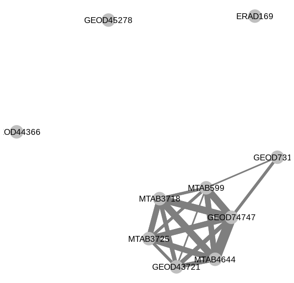
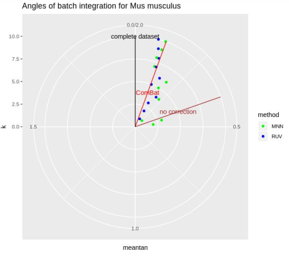

```{r setup, include=FALSE}
knitr::opts_chunk$set(echo = FALSE, message=FALSE, warning=FALSE, fig.align="default", fig.pos="h")
```
# Introduction

# General workflow for the integration of datasets

One of the aims of my internship is to develop a pipeline for the integration of RNA-Seq datasets. I have developed a few R functions that follow the steps of a general pipeline.^[Their usage is explained in detail on this GitHub repository : https://github.com/gheager/Pipeline-for-batch-effect-correction-in-Baseline-experiments]

The first step is very important : it is the removal of isolated experiments.

For a group of experiments whose samples have various biological characteristics, it is important to consider the "biological intersections" of every pair of datasets, i.e. the presence or not of biological replicates across the batches.

```{r fig.cap="Graphs of intersections : the size of edges represents the number of organism parts in common between two experiments", fig.subcap=c('for Mouse : three experiments have to be remove to be able to correct batch effect','for Human : all the experiments are linked together in a connected graph'), fig.ncol=2, fig.scap=NA, out.width='50%', out.height='30%'}
library(cowplot)
ggdraw()+draw_image('article files/intersections mouse.png')
ggdraw()+draw_image('article files/intersections human.png')
#
#
```

<!-- fig.cap=c("Intersections","angles"), out.extra="" -->

<!-- {width=250px} {width=250px} -->

# Several tools to benchmark the different correction algorithms

I introduced three tools that I used to benchmark three batch effect correction algorithms : Empirical Bayes method (also known as ComBat), Removal of Unwanted Variation (RUV) and Mutual Nearest Neighbours (MNN). The last two algorithms have an integer parameter, denoted as $k$, that I have made vary for the comparison.

* Guided PCA comes from an article in *Bioinformatics* by Sarah Reese et al. I wrote a new implementation of this tool in R, where I added some features : the notion of rank of variance, as well as an extrapolation of the $\delta$ statistic to the higher dimensions of PCA.

* Entropy of mixing comes from the exchange that I had during my internship with Ruben Chazarra^[Visiting Scientist at Wellcome Sanger Institute] who was working on a benchmarking of batch effect correction methods within the context of Single Cell experiments.

* I developed myself the approach of Eigengenes Angles in regards to the heterogeneity of the datasets I had to integrate. Contrarily to the two previous approaches, this one doesn't assume any identity of distribution (in terms of biological characteristics) between the datasets, that may lead to confuse batch effect and biological differences in the case of heterogeneous datasets.

I have implemented Guided PCA and Eigengenes Angles methods in a R package called `eigenangles`^[Released on my GitHub account : https://github.com/gheager/eigenangles].

## Guided PCA

The idea of guided PCA is to perform PCA on a batch-aggregated dataset. All the samples from the same batch are averaged (or summed) to form one sample and PCA is performed on these new samples (one sample per batch). This PCA yields some geometrical axes, that we will called guided principal components, different from the ones that standard PCA would give. The original samples (not aggregated) are then projected on these new directions so that the parts of variance of these axes can be estimated.

The guided principal components are found in such a way that they represent somehow the directions of batch effect. If these directions are important compared to standard principal components, i.e. if their variance is comparable to the ones of low rank principal components, it would mean that batch effect is important.

The original article about gPCA introduces a statistic called $\delta$ defined as $$\delta = \frac{\mathbb V gPC_1}{\mathbb V PC_1}$$ where $gPC_1$ denotes the projection of the data (considered as a random variable) on the first guided principal component and $PC_1$ denotes its projection on the first principal component. $\delta$ is actually the variance of the first axis of gPCA, normalised by the variance of the first axis of PCA. As the first axis of PCA is the 1-dimensional subspace which maximises the variance of the projected data, one necessarily has $\delta \leq 1$.

I introduce an extrapolation of this statistic to higher dimensions by considering for $1 \leq k \leq n_{batches}$ by considering :
$$\delta_k := \frac{\mathbb V(gPC_1,...,gPC_k)}{\mathbb V(PC_1,...,PC_k)}$$
where $gPC_k$ (resp. $PC_k$) denotes the projection of data on the $k^{th}$ axis of gPCA (resp. PCA) and $(gPC_1,...,gPC_k)$ denotes the vector formed by the first $k$ guided principal components, which is actually the projection of data on the $k$-dimensional subspace generated by them.

Since the guided principal components are mutually orthogonal, as well as the principal components, we can calculate this new statistic as :
$$\delta_k = \frac{\sum_{i=1}^k \mathbb V gPC_i}{\sum_{i=1}^k \mathbb V PC_i} = \frac{\mathbb V gPC_1 +...+ \mathbb V gPC_k}{\mathbb V PC_1 +...+ \mathbb V PC_k}$$

I also introduce the notion of ranks of variance, defined for a guided principal component as the greatest rank such that the standard principal component of this rank has greater variance than the considered guided principal component.


## Entropy of mixing


## Eigengenes Angles

I introduce here a new method to evaluate the importance of batch effect within an integrated dataset. This method is based on some geometric consideration on the principal components of the single datasets compared to those of their merger (with or without correction). 
As principal components represents geometrical directions, a way to compare them is to estimate the angle between them.

In the simple case where datasets are supposed to have the same distribution, we expect actually the single datasets to have their principal components similar between them and to those of the merged dataset.

As the coefficients of principal components are akin to weights on the genes and represent somehow their involvement in the variance of a dataset, they are a good summary of the information provided by a dataset on the genes. Thus low angles between the respective principal components of each dataset and the ones of their merger means somehow that the information provided by the single datasets has been conserved through their integration.

...

### Advantages of Eigengenes Angles approach for heterogeneous batches

The advantage of the Eigengenes Angles approach is that it is applicable for the integration of heterogeneous datasets, i.e. datasets whose samples have unshared biological characteristic (for example, a dataset with samples from brain and lung and another one whose samples come from lung and liver) or whose proportions of biological group are different. In such a situation, the datasets cannot be supposed to have the same distribution and both gPCA and Entropy of mixing indices may fail to catch the batch effect with precision. Indeed : 

* Guided PCA may detect important batch effect in an integrated dataset (corrected or not) only because its batches have different compositions. 

* In the same way, Entropy of mixing may be irrelevant as its principle is to check whether the batches are well mixed among the nearest neighbours of every sample. However if a sample from a batch doesn't have any biological replicate in the other batches, there is no reason to expect to find samples from the other batches among its nearest neighbours, but rather its biological replicates from the same batch.

In the case of Eigengenes Angles, it is possible to avoid this confounding factor since the angle is calculated on datasets considered individually. Thus it is possible to subset the merged dataset for every comparison by keeping only its biological intersection with the compared batch. After this subsetting step, all the considered samples have at least a replicate in the considered batch. However there is no warranty that their quantitative compositions are the same. To counter this issue, a solution is to aggregate the replicates (by averaging them) within the considered batch and within the merged dataset. An extra advantage of this way to do is that it removes the component of variance that is due to replicating experiments. Only the variance between the different biological groups is conserved.

### Precise framework for the calculation of Eigengenes Angles

The following steps are followed by my implementation of the Eigengenes Angles method, i.e. the `eigenangles` function available in my R package :

For each batch :

- Subset the merged dataset (including the considered batch) by keeping only the samples which have biological replicates in the considered batch (this is what I called above the biological intersection of the batch and the merged dataset);

- Within the considered batch, average the biological replicates;

- Within the merged dataset (including the considered batch), average the biological replicates;

- Compute PCA for the considered averaged batch and for the averaged merged dataset : thus we get two lists of principal components of the same size, that is the number of replicates groups within the considered batch;

- For each rank, calculate the angle between the principal subspaces of this rank from the two lists. For rank 1, this simply corresponds to the angle between the first principal component of the first PCA and the first principal component of the second one. For higher ranks, the process is explained in details below.

Hence we get for each batch, a list of angles of different sizes that are the numbers of replicates groups within the respective batches.

### Mathematical consideration for the calculation of angles in higher dimension

To calculate an angle between two vectors $\vec u$ and $\vec v$ in a space of any dimension, the most commonly used definition is :
$$\widehat{(\vec u,\vec v)}=\arccos\frac{\left< \vec u,\vec v \right>}{\Vert\vec u\Vert\Vert\vec v\Vert}$$
where $\left< \vec u,\vec v \right>$ denotes the euclidian inner product between vectors $\vec u$ and $\vec v$, and $\Vert.\Vert$ denotes the euclidian norm.

To calculate angles between the first principal component of each dataset and the integrated one, this definition can be used easily as $PC1$ are 1-dimensional direction. $\vec u$ shall be chosen as an orientation vector of $PC1$ of the considered individual dataset and $\vec v$ as an orientation vector of $PC1$ of the integrated dataset. In R, orientation vectors of principal components are given by the columns of the `$rotation` element in the output of a call to `prcomp` function.

Although this definition doesn't allow to extrapolate this idea to principal components with higher ranks. Indeed, estimating angles between principal components of higher rank doesn't make sense contrarily to angles between $PC1$, as only $PC1$ maximises the variance of the dataset projected on a 1-dimensional axis. Principal components of higher rank don't have such properties by themselves. However the plane generated by $PC1$ and $PC2$ maximises the variance of the dataset projected on a 2-dimensional subspace, in just the same way as the $n$-dimensional subspace generated by $PC1,...,PCn$ is such that the variance of the dataset projected on such a subspace is maximised.

Therefore the good generalisation of this idea is to compute the angle between the $n$-dimensional subspaces $\operatorname{span}(PC_1^i,...,PC_n^i)$ and $\operatorname{span}(\dot{PC}_1,...,\dot{PC}_n)$. This requires to be able to calculate angles between subspaces, whereas the previous definition only gives a way to calculate angles between vectors and therefore only between 1-dimensional subspaces.

Thus we give the following definition for the angle between two subspaces $U=\operatorname{span}(\vec u_1,...,\vec u_n)$ and $V=\operatorname{span}(\vec v_1,...,\vec v_m)$, parts of a space of dimension $p=m+n$ and where $(\vec u_1,...,\vec u_n)$ and $(\vec v_1,...,\vec v_m)$ are orthonormal bases of those subspaces respectively :
$$\widehat{(U,V)}=\arcsin\det(\vec u_1,...,\vec u_n,\vec v_1,...,\vec v_m)=\arcsin \left|\begin{matrix}
u_1^1 & . & . & . & u_n^1 & v_1^1 & . & . & . & v_m^1\\
. & . & & & . & . & . & & & .\\
. & & . & & . & . & & . & & .\\
. & & & . & . & . & & & . & .\\
u_1^p & . & . & . & u_n^p & v_1^p & . & . & . & v_m^p
\end{matrix}\right|$$
where the coordinates of the vectors are given in an orthonormal basis of the space.
If one disposes of non-orthonormal bases for $U$ and $V$, one can use any orthogonalisation process, such as any $QR$-factorisation method, in order to apply the previous formula legitimately.

Here there is a constraint on the dimension of data, given above by $p=m+n$, due to application of determinant operator, only defined for a square matrix. In our problem, the dimension $p$ of data is the number of genes considered. Although, still in our problem, one wants to calculate angles between two $n$-dimensional subspaces for any value of $n$, so that the condition $p=m+n=2n$ shall not be satisfied in general.

However, this is not a real issue as the $2n$ base vectors $\vec u_1,...,\vec u_n,\vec v_1,...,\vec v_n$ are themselves situated in a $2n$-dimensional subspace, where determinant can be applied as well as in the original $p$-dimensional space. The issue is then to rewrite the problem in this particular subspace i.e. $U+V=\operatorname{span}(U \cup V)$, using an orthonormal basis of this subspace. One can easily find such a basis by performing a $QR$-factorisation to the family of vectors $(\vec u_1,...,\vec u_n,\vec v_1,...,\vec v_n)$ (ordered as columns in a matrix) where the $R$ matrix contains the coordinates of the original vectors in this new basis.

Thus we adopt the following framework to calculate angles between the subspaces $\operatorname{span}(PC_1^i,...,PC_n^i)$ and $\operatorname{span}(\dot{PC}_1,...,\dot{PC}_n)$ for any rank $n$ and any batch $i$ :

- Apply $QR$-factorisation to the family of $p$-dimensional vectors $(PC_1^i,...,PC_n^i,\dot{PC}_1,...,\dot{PC}_n)$ to find their coordinates (given in the $R$ matrix) in an orthonormal basis of their $2n$-dimensional subspace. Thus we get $2n$ new vectors of coordinates (although they represent geometrically the same vectors) whose dimension is also $2n$, that is to say a square matrix to which determinant is applicable. Let's denote $(\widetilde{PC}_1^i,...,\widetilde{PC}_n^i,\widetilde{\dot{PC}}_1,...,\widetilde{\dot{PC}}_n)$ these new vectors of coordinates.

- Apply $QR$-factorisation to the family $(\widetilde{PC}_1^i,...,\widetilde{PC}_n^i)$ to get an orthonormal basis of its span (given in the $Q$ matrix) : $(\widetilde{PC}_1^{i\perp},...,\widetilde{PC}_n^{i\perp})$. Do the same with the family $(\dot{PC}_1,...,\dot{PC}_n)$ to obtain an orthonormal basis of its span : $(\widetilde{\dot{PC}}_1^\perp,...,\widetilde{\dot{PC}}_n^\perp)$

- Hence the angle between the subspaces $\operatorname{span}(PC_1^i,...,PC_n^i)$ and $\operatorname{span}(\dot{PC}_1,...,\dot{PC}_n)$ is given by :
$$\alpha^i_n=\arcsin\det(\widetilde{PC}_1^{i\perp},...,\widetilde{PC}_n^{i\perp},\widetilde{\dot{PC}}_1^\perp,...,\widetilde{\dot{PC}}_n^\perp)$$

### Quantitative benchmarking with Eigengenes Angles

The issue of Eigengenes Angles is the quantity of information that they provide. Indeed the result of the algorithm I have described above is a list of lists of angles. To make a quantitative benchmarking of the correction algorithms, it is necessary to summarise this information in a unique number.

Actually the method I suggest to reduce this information will not return a unique number but a limited quantity of numbers. Indeed, it makes sense to aggregate 

# Benchmarking for *Mus musculus* and *Homo sapiens* baseline datasets with organism part as biological covariate

## Guided PCA

## Entropy of mixing

## Eigengenes Angles

To have a quantitative benchmarking of the different algorithms, one has to summarise the eigengenes angles as one number.

The following plot summarises

```{r fig.cap="Eigenangles for Mouse", fig.subcap=c('batch integration','batch modification'), fig.ncol=2, fig.scap=NA, out.width='50%', out.height='30%'}
ggdraw()+draw_image('article files/angles mouse.png')
ggdraw()+draw_image('article files/angles modif mouse.png')
```


# Conclusion
